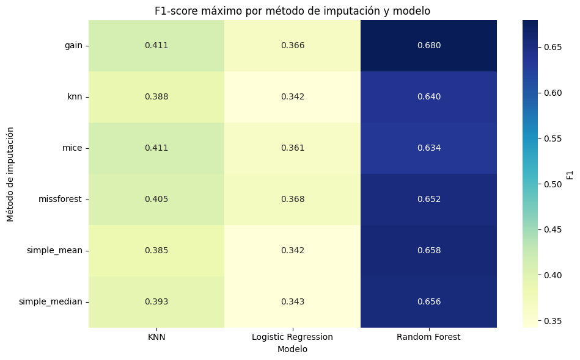
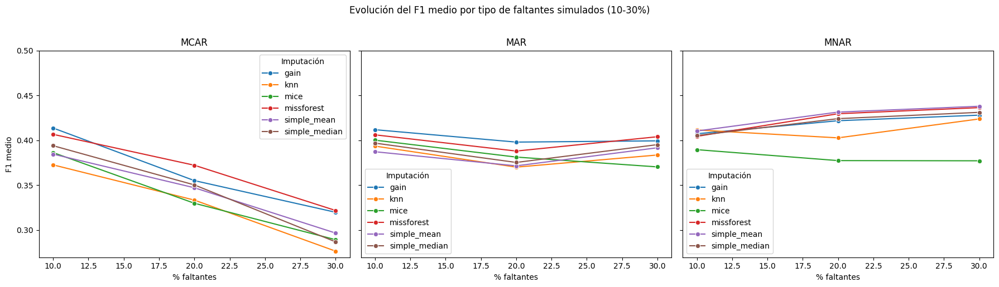

# Missing Data Imputation Benchmark in Biomedical Datasets

> **Bachelor's Thesis (TFG) — BSc in Statistics, University of Salamanca (2025)**  
> Comparison of missing data imputation algorithms on the NHANES biomedical dataset.

---

## Overview

Missing data is a pervasive problem in real-world biomedical research. The choice of imputation method can substantially affect the performance of downstream predictive models — yet systematic comparisons under controlled conditions remain scarce.

This project benchmarks **6 imputation methods** combined with **3 classification models**, evaluated across **3 missing data mechanisms** (MCAR, MAR, MNAR) at **3 missingness levels** (10%, 20%, 30%), with and without class balancing via SMOTE. The result is a structured comparison of **360 unique imputation–model combinations**.

The target task is binary classification of **diabetes diagnosis** using the NHANES dataset.

---

## Imputation Methods

| Method | Type | Library |
|---|---|---|
| Mean | Simple univariate | `scikit-learn` |
| Median | Simple univariate | `scikit-learn` |
| kNN | Multivariate | `scikit-learn` |
| MICE | Multivariate (iterative) | `hyperimpute` |
| MissForest | Multivariate (Random Forest) | `hyperimpute` |
| GAIN | Deep learning (GAN-based) | `hyperimpute` |

---

## Classification Models

- k-Nearest Neighbors
- Logistic Regression
- Random Forest

---

## Evaluation Metrics

- **F1-score** — primary metric; handles class imbalance
- **ROC AUC** — global discriminative ability
- **PR AUC** — precision-recall tradeoff for the minority class

---

## Experimental Design

The project runs two complementary experiments on the same cleaned NHANES dataset:

**Experiment 1 — Natural missingness**  
The original NHANES dataset contains real missing values. All 6 imputation methods are applied directly and models are evaluated on the resulting datasets.

**Experiment 2 — Simulated missingness**  
Missing values are artificially introduced into the 15 most predictive variables (selected by Random Forest feature importance) under three controlled mechanisms:

- **MCAR** — values removed completely at random
- **MAR** — values removed conditional on observed variables (age, poverty, education, self-reported health)
- **MNAR** — values removed based on the value itself (extreme values, sensitive categories)

Each mechanism is applied at 10%, 20%, and 30% missingness rates, generating 9 additional datasets.

Each dataset × imputation method × classification model combination is evaluated with and without **SMOTE** oversampling to address the class imbalance in the target variable (7.7% positive class).

All experiments use stratified 80/20 train-test splits and 5-fold stratified cross-validation. Imputation is always fit on training data only to prevent data leakage.

---

## Key Results

### Average performance by imputation method

| Imputation | F1-score ↑ | ROC AUC ↑ | PR AUC ↑ | Stability (F1 std) ↓ |
|---|---|---|---|---|
| **GAIN** | **0.402** | **0.878** | **0.463** | 0.113 |
| **MissForest** | **0.402** | 0.870 | 0.449 | **0.110** |
| Median | 0.391 | 0.862 | 0.429 | 0.123 |
| Mean | 0.390 | 0.861 | 0.429 | 0.120 |
| kNN | 0.380 | 0.859 | 0.426 | 0.115 |
| MICE | 0.376 | 0.872 | 0.443 | **0.100** |

### F1-score by imputation method × classifier



> Random Forest dominates across all imputation methods. GAIN + Random Forest achieves the highest peak F1 (0.680).

### F1-score evolution by mechanism and missingness rate



> **MCAR** degrades consistently as missingness increases. **MAR** remains stable even at 30%. **MNAR** trends upward — counterintuitively — due to the structured and predictable nature of the simulated extreme values.

### Main findings

- **GAIN + Random Forest** and **MissForest + Random Forest** are the top-performing combinations across all metrics.
- **Simple methods (mean, median) are surprisingly competitive** — their gap vs. advanced methods is small, especially with Random Forest.
- **Classifier choice matters more than imputer choice**, as long as a reasonable imputation method is used.
- **SMOTE improves F1-score by ~5.8 points** on average, with a minor trade-off in PR AUC.
- **MICE is the most stable** method (lowest F1 std = 0.100) but has the widest total range, suggesting occasional failure cases.

---

## Dataset

This project uses the **NHANES (National Health and Nutrition Examination Survey)** dataset, accessed via the [`NHANES` R package](https://CRAN.R-project.org/package=NHANES), which combines data from the 2009–2010 and 2011–2012 CDC survey cycles (~10,000 individuals, 76 variables).

After a three-stage cleaning process, **34 variables** were retained (continuous and categorical), covering clinical, sociodemographic, and lifestyle domains.

> ⚠️ The version used here has been preprocessed for methodological analysis. Survey weights and strata have been removed. Results should not be interpreted as population-level epidemiological estimates.

Official source: https://www.cdc.gov/nchs/nhanes/

---

## Repository Structure

```
missing-data-imputation-benchmark/
│
├── notebooks/
│   ├── Limpieza_inicial_dataset_NHANES.ipynb       # Data cleaning (3-stage pipeline)
│   ├── Generador_Datasets_FaltantesSimulados.ipynb # MCAR / MAR / MNAR simulation
│   ├── Experimento.ipynb                           # Full imputation + model pipeline
│   └── Resultados_Visualizar_y_Analizar.ipynb      # Visualizations and analysis
│
├── src/
│   └── download_nhanes_dataset.R                   # Dataset download via R NHANES package
│
├── data/                                           # Processed datasets (.parquet)
│
├── results/
│   └── figures/                                    # Heatmaps, radar plots, boxplots, etc.
│
├── requirements.txt
├── README.md
└── tfg_paper.pdf                                   # Full thesis document
```

---

## Technologies

| Tool | Purpose |
|---|---|
| Python 3.x | Main language |
| pandas, NumPy | Data manipulation |
| scikit-learn | Imputation (mean, median, kNN), models, metrics |
| hyperimpute | MICE, MissForest, GAIN imputation |
| imbalanced-learn | SMOTE oversampling |
| matplotlib, seaborn | Visualization |
| Apache Arrow / Parquet | Efficient data storage |
| R + NHANES package | Dataset acquisition |
| Jupyter Notebook / Google Colab | Development environment |

---

## Installation

```bash
pip install -r requirements.txt
```

> GAIN and MissForest depend on `hyperimpute`, which requires additional system dependencies. See [hyperimpute documentation](https://github.com/vanderschaarlab/hyperimpute) for setup details.

---

## Reproducing the Experiments

Run the notebooks in the following order:

1. `src/download_nhanes_dataset.R` — download and export raw dataset
2. `Limpieza_inicial_dataset_NHANES.ipynb` — clean and preprocess
3. `Generador_Datasets_FaltantesSimulados.ipynb` — simulate missing data
4. `Experimento.ipynb` — run all imputation + model combinations
5. `Resultados_Visualizar_y_Analizar.ipynb` — generate plots and tables

All random seeds are fixed (`random_state=42`) for full reproducibility.

---

## Author

**Jorge Otaduy Pérez**  
BSc in Statistics — University of Salamanca  
Thesis supervised by Pedro Ignacio Dorado Díaz  
July 2025
